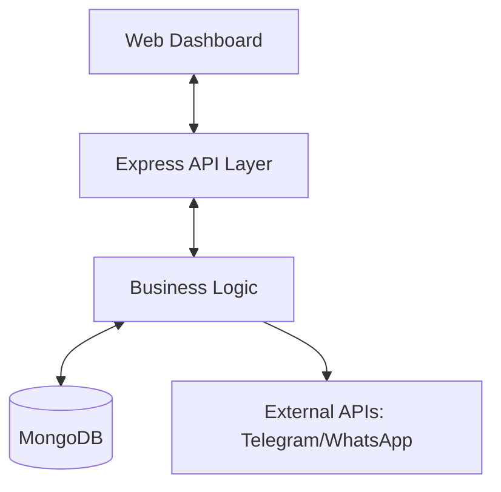

# System Design & Construction (SDC) Document

**Project Name:** Campus Event Assistant Chatbot
**Version:** 1.0
**Date:** December 11, 2025
**Author:** Development Team

---

## 1. Introduction

### 1.1 Purpose
The **System Design & Construction (SDC)** document serves as the comprehensive technical reference for the *Campus Event Assistant Chatbot*. It bridges the gap between theoretical requirements and the physical realization of the software, detailing *how* the system is designed and *how* it has been constructed.

### 1.2 Scope
This document covers the high-level Architectural Design, Detailed Data Design, Interface Specifications, and the Construction specifics including development methodology, environment setup, and module implementation details.

---

## 2. System Design

### 2.1 Architectural Design
The system utilizes a **Client-Server Architecture** decoupled via RESTful APIs, facilitating modularity and scalability.

*   **Frontend (Client)**: A lightweight Dashboard and Chat Interface built with HTML5, Vanilla CSS (Glassmorphism), and JavaScript. It communicates with the backend via asynchronous HTTP requests.
*   **Backend (Server)**: A Node.js runtime environment using the Express.js framework to handle routing, business logic, and database operations.
*   **Database**: MongoDB (NoSQL) hosted on Atlas, providing flexible schema design for JSON-like interaction data.

### 2.2 Component Diagram


### 2.3 Data Design
The database utilizes a document-oriented model.

#### 2.3.1 User Collection (`users`)
*   **_id**: ObjectId (Primary Key)
*   **username**: String (Unique, Indexed)
*   **password**: String (Hashed via SHA-256)
*   **isAdmin**: Boolean (Role management)

#### 2.3.2 Event Collection (`events`)
*   **title**: String
*   **date**: String (Display format)
*   **location**: String
*   **description**: String
*   **reviews**: Array of Objects (User feedback)

### 2.4 Interface Design
*   **API Interface**: REST application/json standard.
    *   `GET /api/events`: Retrieve event list.
    *   `POST /api/auth/login`: Authenticate users.
*   **User Interface**:
    *   **Theme**: Dark mode with localized glassmorphism effects.
    *   **Navigation**: Sidebar for module switching (Chat, Live Events, Admin).

---

## 3. System Construction

### 3.1 Development Methodology
The project follows the **Agile Iterative approach**. Development is broken down into sprints focusing on specific functional modules (e.g., "Auth Sprint", "Chat Sprint"), allowing for continuous testing and refinement.

### 3.2 Development Environment
*   **OS**: Windows 10/11
*   **Runtime**: Node.js v16+
*   **Database Engine**: MongoDB v5.0+
*   **IDE**: Visual Studio Code with Prettier and ESLint.
*   **Version Control**: Git (Feature Branch Workflow).

### 3.3 Module Implementation Details

#### 3.3.1 Authentication Module
*   **Logic**: Implemented in `authController.js`.
*   **Security**: Uses standard session/token storage in the client. Passwords are hashed before storage.
*   **Construction**:
    ```javascript
    // Pseudocode for login
    if (hash(inputPassword) === storedPassword) {
        return generateToken(user);
    }
    ```

#### 3.3.2 Event Management Module
*   **Logic**: Full CRUD capabilities restricted by middleware.
*   **Access Control**: Middleware checks `req.user.isAdmin` before allowing DELETE or POST operations on events.

#### 3.3.3 Chatbot Integration
*   **Polling Mechanism**: The server uses a polling loop (or webhook in production) to check for updates from the Telegram API.
*   **Response Logic**: A switch-case structure matches keywords (e.g., "/start", "events") to return pre-formatted JSON responses or database results.

### 3.4 Coding Standards
*   **Naming Conventions**: CamelCase for variables/functions (`getUserEvents`), PascalCase for Classes/Models (`EventModel`).
*   **Error Handling**: Centralized error middleware captures async exceptions to prevent server crashes.

---

## 4. Testing & Validation

System construction included rigorous testing at multiple levels:
*   **Unit Testing**: Validating isolated utility functions.
*   **Integration Testing**: Verifying `Frontend <-> Backend <-> Database` data flow.
*   **User Acceptance Testing (UAT)**: Validating the "Glassmorphic" UI against design proofs.

## 5. Deployment

The constructed system is deployed on **Render.com** (Auto-Deployment from GitHub).
*   **Environment Variables**: `MONGODB_URI` and `PORT` are injected at runtime for security.
*   **Build Script**: `npm install` handles dependency resolution.
