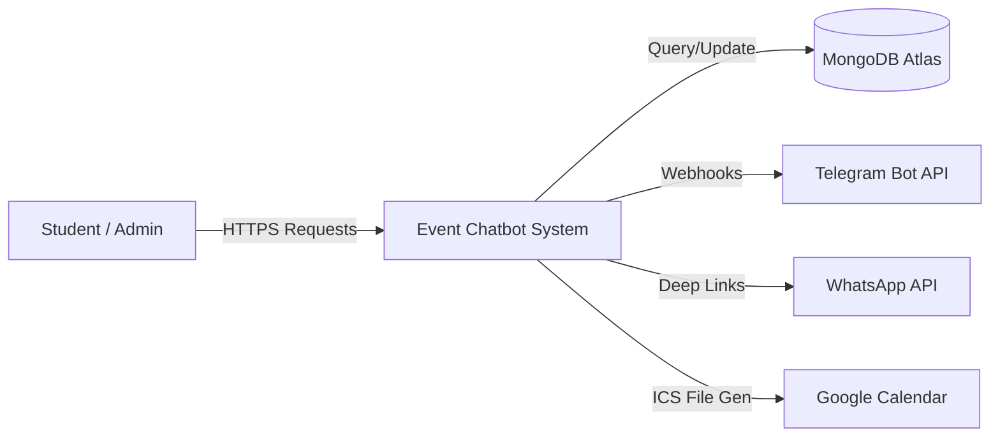

# System Design Specification (SDS)

**Project Name:** Campus Event Assistant Chatbot
**Version:** 2.0
**Date:** December 11, 2025
**Author:** Development Team

---

## 1. Executive Summary
The **Campus Event Assistant** is a cross-platform conversational agent designed to centralize event management for educational institutions. This document outlines the architectural blueprint, data structures, component interactions, and interface definitions required to build the system. The system leverages a **MERN-lite stack** (MongoDB, Express, Node.js) with vanilla frontend technologies to ensure lightweight performance and ease of deployment.

## 2. System Architecture

### 2.1 Architectural Pattern
The system follows a **Client-Server Architecture** decoupled via RESTful APIs. This separation of concerns allows the frontend to run independently of the backend logic, facilitating future scalability (e.g., swapping the web frontend for a mobile app).

### 2.2 System Context Diagram (Context Level 0)
The following diagram illustrates the interaction between the User, the Chatbot System, and external entities.

### 2.3 Component Diagram
1.  **Presentation Layer (Frontend)**
    *   **Dashboard Module**: Handles the Single Page Application (SPA) routing, view switching (Live/Past Events), and local state management.
    *   **Chat Interface**: Manages the conversational UI, message history rendering, and typing indicators.
    *   **Auth Module**: Manages JWT/Session storage in `localStorage` and controls access to the Admin Panel.

2.  **Logic Layer (Backend API)**
    *   **Express Server**: The central request handler.
    *   **Routers**:
        *   `/api/auth`: Handles specialized login/registration logic.
        *   `/api/events`: RESTful CRUD endpoints for event data.
        *   `/api/webhooks`: Endpoint for processing incoming Telegram updates.
    *   **Controllers**: Contains the business rules (e.g., "Only Admins can delete events").

3.  **Data Layer (Persistence)**
    *   **MongoDB**: a NoSQL database chosen for its flexibility with JSON-like documents.

## 3. Data Dictionary & Schema Design

### 3.1 User Collection (`users`)
Stores authentication credentials and privilege levels.
| Field Name | Data Type | Required | Default | Description |
|:---|:---|:---|:---|:---|
| `_id` | ObjectId | Yes | Auto | Unique Primary Key |
| `username` | String | Yes | - | Unique user identifier |
| `password` | String | Yes | - | SHA-6 (minimum) hashed string |
| `isAdmin` | Boolean | No | `false` | Grants access to Admin Panel |
| `createdAt` | Date | Yes | `now()` | Timestamp of registration |

### 3.2 Event Collection (`events`)
Stores all details regarding campus activities.
| Field Name | Data Type | Required | Description |
|:---|:---|:---|:---|
| `title` | String | Yes | Name of the event |
| `date` | String | Yes | Human-readable date (e.g., "25 Dec") |
| `time` | String | Yes | Time of event |
| `location` | String | Yes | Physical venue or Zoom link |
| `description`| String | No | Detailed summary |
| `image` | String | No | URL to Unsplash/hosted image |
| `reviews` | Array<Object> | No | List of `{user, comment, rating}` |

## 4. Interface Specification

### 4.1 Application Programming Interface (API)
The backend exposes the following REST endpoints:

#### **Authentication**
*   `POST /api/register`: Validates uniqueness of user and creates record.
*   `POST /api/login`: Validates credentials and returns User Object + Token.

#### **Event Management**
*   `GET /api/events`: Returns array of all Event objects. Supports query params `?category=social`.
*   `POST /api/events`: (Admin Only) Creating a new event resource.
*   `DELETE /api/events/:id`: (Admin Only) Soft or Hard delete of an event.
*   `POST /api/events/:id/reviews`: Appends a review object to the event's review array.

### 4.2 User Interface (UI) Guidelines
*   **Design Language**: Glassmorphism.
    *   **Translucency**: UI cards must use `backdrop-filter: blur(Npx)` to simulate frosted glass.
    *   **Colors**: Use high-contrast gradients (Indigo/Purple) to convey modernism.
*   **Responsiveness**: The dashboard must collapse the Sidebar into a "Hamburger Menu" on mobile viewports (<768px).

## 5. Security & Performance
### 5.1 Security Measures
1.  **Sanitization**: All inputs are sanitized to prevent NoSQL Injection.
2.  **CORS Policy**: Restricted to allowed domains in production.
3.  **Hashed Passwords**: Passwords are never stored in plain text.

### 5.2 Performance Requirements
1.  **Latency**: API responses must occur within <200ms for standard queries.
2.  **Availability**: System uptime target is 99.9% via Render.com hosting.
