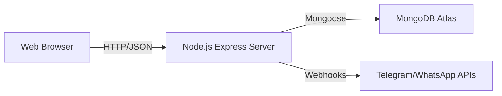

# System Design Specification (SDS)

**Project:** Campus Event Assistant Chatbot
**Version:** 1.0

---

## 1. Introduction
This document specifies the architectural design, data structures, and interface definitions for the Campus Event Assistant Chatbot. It serves as a blueprint for the implementation phase.

## 2. System Architecture
The system utilizes a **Client-Server Architecture** decoupled via RESTful APIs.

### 2.1 High-Level Diagram

### 2.2 Components
1.  **Frontend (Client)**:
    *   **Technalogies**: HTML5, CSS3, JavaScript (ES6+).
    *   **Modules**: Chat Widget, Event Dashboard, Auth Forms, Sidebar Navigation.
    *   **Responsibility**: User interaction, rendering UI, making Async API calls.

2.  **Backend (Server)**:
    *   **Technologies**: Node.js, Express.js.
    *   **Modules**: 
        *   `authController`: Handles Login/Register.
        *   `eventController`: CRUD operations for Events.
        *   `botController`: Manages Telegram/WhatsApp webhooks.
    *   **Responsibility**: Business logic, request processing, database interaction.

3.  **Database**:
    *   **Technology**: MongoDB (NoSQL).
    *   **Responsibility**: Persistent storage of Users and Events.

## 3. Data Design (Schema)

### 3.1 User Schema
| Field | Type | Description |
|-------|------|-------------|
| `username` | String | Unique identifier |
| `password` | String | Hashed password |
| `isAdmin` | Boolean | Privileged access flag |

### 3.2 Event Schema
| Field | Type | Description |
|-------|------|-------------|
| `title` | String | Event Name |
| `date` | String | Event Date |
| `time` | String | Event Time |
| `location` | String | Venue |
| `image` | String | URL to cover image |
| `reviews` | Array | List of user reviews `{user, comment}` |
| `registrationLink`| String | WhatsApp/External Link |

## 4. Interface Design

### 4.1 API Endpoints
-   `GET /api/events` : Retrieve all events.
-   `POST /api/events` : Create a new event.
-   `POST /api/login` : Authenticate user.
-   `POST /api/register` : Create new user.

### 4.2 User Interface
-   **Dashboard**: A glassmorphic design featuring a sidebar for navigation and a main content area for dynamic views.
-   **Color Palette**: 
    -   Primary: Indigo (`#6366f1`)
    -   Background: Dark/Light hybrid (`#f3f4f6` / `#1e1e2d`)

## 5. Security Design
-   **Authentication**: Session-based auth using LocalStorage on client and memory/DB validation on server.
-   **Data Protection**: SHA-256 hashing for passwords (upgradeable to bcrypt).
-   **Input Validation**: Server-side validation for all API inputs to prevent injection.
